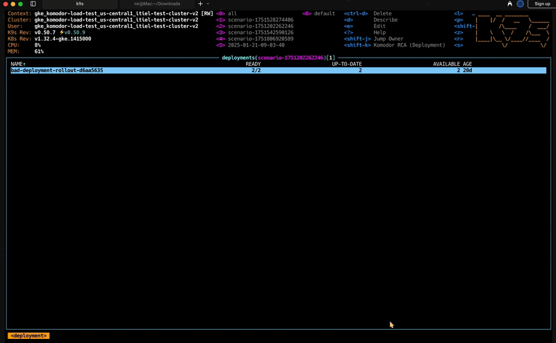

# K9s Komodor RCA Plugin

A powerful K9s plugin that integrates Komodor's Root Cause Analysis (RCA) directly into your Kubernetes workflow. Trigger RCA analysis for any Kubernetes resource with a simple keyboard shortcut while browsing your cluster in K9s.



## 🚀 What is this?

This plugin allows you to seamlessly trigger Komodor's RCA analysis from within K9s without leaving your terminal. When you encounter an issue with a pod, deployment, or service, simply select it in K9s and press `Shift-K` to start an RCA session.

**Built with Go** - This is a native Go binary that provides fast, reliable RCA triggering with comprehensive error handling and real-time monitoring capabilities.

## 🎯 Why use this plugin?

- **Instant RCA**: No need to switch between tools - trigger RCA analysis directly from K9s
- **Context-aware**: Automatically uses the selected resource's namespace, name, and cluster
- **Streamlined workflow**: Reduce context switching when investigating Kubernetes issues
- **Keyboard-driven**: Fits perfectly into K9s' keyboard-centric interface
- **Comprehensive logging**: All operations are logged to `~/.k9s_komodor_logs.txt` for debugging

## 📋 Prerequisites

### Komodor Account & API Key

You need to be a **Komodor customer** to use this plugin. The plugin calls Komodor's API to trigger RCA sessions.

1. **Sign up for Komodor**: Visit [komodor.com](https://komodor.com) to create an account
2. **Generate API Key**: 
   - Log into your Komodor dashboard
   - Navigate to **Settings** → **API Keys**
   - Click **Create New API Key**
   - Give it a descriptive name (e.g., "K9s RCA Plugin")
   - Copy the generated API key

### Required Tools

- **K9s**: Kubernetes CLI tool ([installation guide](https://k9scli.io/topics/install/))
- **Go 1.21+**: For building from source (optional, pre-built binaries available)

## 🛠️ Installation

### Prerequisites

Before installing, make sure you have:

1. **Komodor Account & API Key** (see [Prerequisites](#prerequisites) section above)
2. **K9s installed** ([installation guide](https://k9scli.io/topics/install/))
3. **Environment variables set**:
   ```bash
   export KOMODOR_API_KEY="your-komodor-api-token-here"
   export KOMODOR_CLUSTER_NAME="your-cluster-name"
   ```

### Installation Methods

#### Method 1: Quick Install (Recommended)

```bash
# Clone the repository
git clone https://github.com/komodorio/k9s-RCA.git
cd k9s-RCA

# Build and install everything
make install-plugin
```

#### Method 2: Download Pre-built Binary

**Step 1: Download the binary**
```bash
# Detect your platform and download the appropriate binary
OS=$(uname -s | tr '[:upper:]' '[:lower:]')
ARCH=$(uname -m)

# Map architecture
case $ARCH in
    x86_64) ARCH="amd64" ;;
    aarch64|arm64) ARCH="arm64" ;;
    *) echo "Unsupported architecture: $ARCH" && exit 1 ;;
esac

# Download binary
curl -L -o k9s-rca "https://github.com/komodorio/k9s-RCA/releases/latest/download/k9s-rca-${OS}-${ARCH}"
chmod +x k9s-rca

# Install to your PATH
sudo mv k9s-rca /usr/local/bin/
# OR for user installation
mkdir -p ~/.local/bin
mv k9s-rca ~/.local/bin/
```

**Step 2: Install plugin configuration**
```bash
# Create k9s config directory
mkdir -p ~/.config/k9s

# Download plugin configuration
curl -L -o ~/.config/k9s/plugins.yaml "https://raw.githubusercontent.com/komodorio/k9s-RCA/main/k9s_rca_plugin.yaml"
```

#### Method 3: Build from Source

```bash
# Clone the repository
git clone https://github.com/komodorio/k9s-RCA.git
cd k9s-RCA

# Build the binary
go build -o k9s-rca .

# Install binary
sudo cp k9s-rca /usr/local/bin/
# OR
cp k9s-rca ~/.local/bin/

# Install plugin configuration
mkdir -p ~/.config/k9s
cp k9s_rca_plugin.yaml ~/.config/k9s/plugins.yaml
```

#### Method 4: Using the Build Script

```bash
# Clone the repository
git clone https://github.com/komodorio/k9s-RCA.git
cd k9s-RCA

# Run the build script
chmod +x scripts/build-release.sh
./scripts/build-release.sh

# Install from the generated release
cd release
./install.sh
./install-plugin.sh
```

### Verify Installation

After installation, verify everything is working:

```bash
# Check if binary is installed and executable
which k9s-rca
k9s-rca --help

# Check if plugin configuration is in place
ls -la ~/.config/k9s/plugins.yaml

# Test the plugin in k9s
k9s
# Navigate to a resource (e.g., :po for pods)
# Press Shift-K to trigger RCA
```

### Troubleshooting Installation

**Binary not found:**
```bash
# Check if binary is in PATH
which k9s-rca

# If not found, add ~/.local/bin to PATH
echo 'export PATH="$HOME/.local/bin:$PATH"' >> ~/.bashrc
source ~/.bashrc
```

**Plugin not working:**
```bash
# Check plugin configuration
cat ~/.config/k9s/plugins.yaml

# Restart k9s completely
pkill k9s
k9s
```

## 🎮 Usage

### Basic Workflow

1. **Open K9s**: `k9s`
2. **Navigate to a resource view**:
   - `:po` for pods
   - `:deploy` for deployments  
   - `:svc` for services
   - `:sts` for statefulsets
   - `:ds` for daemonsets
3. **Select a resource**: Use arrow keys to highlight the resource
4. **Trigger RCA**: Press `Shift-K` or use the command `:rca`

### Available Triggers

#### Keyboard Shortcuts
| Shortcut | Description | Available In |
|----------|-------------|-------------|
| `Shift-K` | Trigger RCA analysis for selected resource | Pods, Deployments, Services, StatefulSets, DaemonSets |

### Advanced Features

- **Real-time monitoring**: Watch RCA progress with live updates
- **Error handling**: Detailed error messages and recovery suggestions

## 🔧 Configuration

### Environment Variables

| Variable | Description | Default |
|----------|-------------|---------|
| `KOMODOR_API_KEY` | Your Komodor API token | Required |
| `KOMODOR_CLUSTER_NAME` | Your cluster name | Required |

### Command Line Options

The binary supports several command-line flags for advanced usage:

```bash
k9s-rca --help
```

Available flags:
- `--kind`: Kubernetes resource kind (Pod, Deployment, Service, etc.)
- `--namespace`: Kubernetes namespace
- `--name`: Kubernetes resource name
- `--api-key`: Komodor API key (overrides environment variable)
- `--cluster`: Kubernetes cluster name (overrides environment variable)
- `--base-url`: Komodor API base URL (overrides environment variable)
- `--poll`: Poll for RCA completion
- `--background`: Run in background mode

### Customizing Shortcuts

You can modify the shortcuts in the plugin configuration:

```yaml
plugins:
  rca-pod:
    shortCut: Shift-K  # Change to your preferred shortcut
    description: "Komodor RCA (Pod)"
    # ... rest of configuration
```

**Available shortcut formats:**
- `Ctrl+Key` (e.g., `Shift-K`, `Ctrl+Q`) - Works on both Mac and Linux
- `Cmd+Key` (Mac only, e.g., `Cmd+R`)
- `Alt+Key` (e.g., `Alt+R`)
- `Shift+Key` (e.g., `Shift+R`)

### Customizing Resource Types

You can modify the plugin configuration to support additional Kubernetes resource types:

```yaml
plugins:
  rca-custom:
    shortCut: Shift-K
    description: "RCA for Custom Resource"
    scopes:
    - crd         # Custom Resource Definition
    - ing         # Ingress
    - cm          # ConfigMap
    command: sh
    # ... rest of configuration
```

## 🐛 Troubleshooting

### Common Issues

**"RCA failed" error**
- Verify your `KOMODOR_API_KEY` is set correctly
- Check if the API token has the necessary permissions
- Ensure you have network connectivity to api.komodor.com
- Check the log file: `tail ~/.k9s_komodor_logs.txt`

**Plugin not appearing in K9s**
- Verify the plugins.yaml file is in the correct location (`~/.config/k9s/plugins.yaml`)
- Check the YAML syntax is correct
- Restart K9s after making changes
- Ensure the binary is in your PATH: `which k9s-rca`
- Verify k9s is loading it using k9s 

**"Missing required k9s environment variables"**
- Make sure you're running the plugin on a selected resource
- Verify you're in the correct resource view (pods, deployments, etc.)

**Binary not found**
- Check if the binary is installed: `which k9s-rca`
- Reinstall using: `make install-plugin`
- Verify the binary is executable: `ls -la $(which k9s-rca)`

**Shortcut conflicts**
- If `Shift-K` conflicts with other shortcuts, change it in the plugin configuration
- Use the command-based trigger (`:rca`) as an alternative

**Blank screen when using shortcuts**
- Check the log file for errors: `tail ~/.k9s_komodor_logs.txt`
- Verify environment variables are set correctly
- Try using the `:rca` command instead
- Test the binary directly: `k9s-rca --help`

### Debug Mode

The plugin automatically logs all operations. To see real-time logs:

```bash
# Watch logs in real-time
tail -f ~/.k9s_komodor_logs.txt

# Check recent logs
tail -20 ~/.k9s_komodor_logs.txt
```

## 🔍 How it Works

1. **K9s Integration**: The plugin leverages K9s' plugin system and environment variables
2. **Context Detection**: K9s automatically provides resource context (`$NAMESPACE`, `$NAME`, `$CLUSTER`)
3. **API Call**: The plugin makes a POST request to Komodor's RCA API endpoint
4. **RCA Session**: Komodor creates an RCA session for the specified resource
5. **Logging**: All operations are logged to `~/.k9s_komodor_logs.txt`

### API Request Format

```json
{
  "namespace": "default",
  "name": "my-app-pod",
  "kind": "Pod",
  "clusterName": "production-cluster"
}
```

## 🤝 Contributing

This plugin is open for contributions! Common improvements:

- Add support for more Kubernetes resource types
- Enhance error handling and user feedback
- Add configuration options for different RCA types
- Improve the visual output
- Add tests and improve test coverage
- Optimize build process and release automation

### Development Setup

```bash
# Clone the repository
git clone https://github.com/komodorio/k9s-RCA.git
cd k9s-RCA

# Install dependencies
make deps

# Build for development
make dev

# Run tests
make test

# Build for release
make release
```

### Creating GitHub Releases

To create a new release:

```bash
# Build all binaries and create release archives
./scripts/build-release.sh

# The script will create:
# - Binaries in dist/ directory
# - Release archives in release/ directory
# - Install scripts for easy deployment

# Upload the files from release/ directory to GitHub releases
```

**Release files created:**
- `k9s-rca-{version}-{platform}.tar.gz` - Compressed binaries with checksums
- `k9s-rca-{version}-windows-amd64.zip` - Windows binary
- `install.sh` - Auto-installation script
- `install-plugin.sh` - Plugin configuration installer

## 📚 Resources

- [K9s Documentation](https://k9scli.io/)
- [K9s Plugins Guide](https://k9scli.io/topics/plugins/)
- [Komodor Documentation](https://help.komodor.com/)
- [Komodor API Documentation](https://api.komodor.com/api/docs/index.html)
- [Go Documentation](https://golang.org/doc/)
- [Cobra CLI Framework](https://github.com/spf13/cobra)

## 📄 License

This project is licensed under the MIT License. Please refer to Komodor's terms of service for API usage.

---

**Need help?** Check out the [Komodor documentation](https://help.komodor.com/) or reach out to Komodor support for API-related questions.
